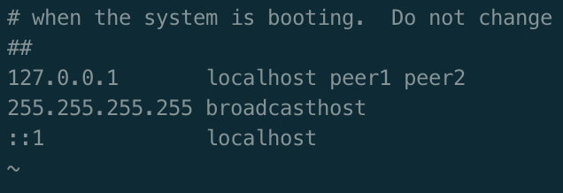

# Eureka

## 简介

Eureka是Netflix开发的服务发现框架，本身是一个基于REST的服务，主要用于定位运行在AWS域中的中间层服务，以达到负载均衡和中间层服务故障转移的目的。SpringCloud将它集成在其子项目spring-cloud-netflix中，以实现SpringCloud的服务发现功能。

### 架构图


### 说明

Eureka包含两个组件：Eureka Server 和 Eureka Client。

- Eureka Server提供服务发现能力，各个微服务启动时，会在Eureka Server中注册信息，包括IP、端口、微服务名称等。
- Eureka Server支持集群部署，首尾相连形成闭环即可，集群中多个Eureka实例之间通过异步模式互相复制的方式来进行数据同步。
- Eureka Client通过注册和参数配置的方式嵌入在客户端应用程序的代码中，微服务启动后会周期性（默认30s）向Eureka Server发送心跳来更新服务租约。同事，它也能从服务端查询当前注册的服务信息并把它们缓存到本地并周期行的刷新服务状态。
- Eureka Client会缓存服务注册表中的信息到本地，这样微服务无需每次请求都查询Eureka Server，降低了Eureka Server的压力；其次，即使Eureka Server所有节点都宕掉，服务消费者依然可以使用缓存中的信息找到服务提供者并完成调用。

## 代码实现

### Eureka Server

1. 创建Maven工程[spring-cloud-notes-eureka](../spring-cloud-notes-eureka)并添加以下依赖。

   ```xml
   <dependencies>
       <dependency>
           <groupId>org.springframework.cloud</groupId>
           <artifactId>spring-cloud-starter-netflix-eureka-server</artifactId>
       </dependency>
   </dependencies>
   ```

2. 编写启动类，添加@EnableEurekaServer注解。

   ```java
   @SpringBootApplication
   @EnableEurekaServer
   public class EurekaApplication {
       public static void main(String[] args) {
           SpringApplication.run(EurekaApplication.class, args);
       }
   }
   ```

3. 编写配置文件application.yml，下面为双节点的Eureka Server集群的配置。

   ```yml
   spring:
     application:
       name: @pom.artifactId@
   
   eureka:
     server:
       #关闭自我保护，开发环境下关闭
       enable-self-preservation: false
       #清理间隔，默认60000ms，开发环境下修改为5000ms
       eviction-interval-timer-in-ms: 5000
       #节点间读数据连接超时时间
       peer-node-read-timeout-ms: 200
     client:
       serviceUrl:
         defauleZone: http://peer1:8761/eureka/,http://peer2:8762/eureka/
   
   ---
   spring:
     profiles: peer1
   server:
     port: 8761
   eureka:
     instance:
       hostname: peer1
   
   ---
   spring:
     profiles: peer2
   server:
     port: 8762
   eureka:
     instance:
       hostname: peer2
   ```

4. 如果两个Eureka Server实例在同一台机器上启动，需要配置hosts，因为Eureka Server对端口是不敏感的，这意味着，如果直接用IP的形式（例如地址写成http://127.0.0.1:8761/eureka/）相互注册，Eureka Server误认为两个Eureka Server实例是一个实例，这会造成Eureka Server首页显示不正常等一系列问题。

   在hosts文件中添加如下内容：

   127.0.0.1       peer1 peer2

   

### 将微服务注册到Eureka Server上

1. 在微服务项目中添加以下依赖。

   ```xml
   <dependencies>
       <dependency>
           <groupId>org.springframework.cloud</groupId>
           <artifactId>spring-cloud-starter-netflix-eureka-client</artifactId>
       </dependency>
   </dependencies>
   ```

2. 在配置文件application.yml中添加以下配置，

   ```yml
   eureka:
     client:
       serviceUrl:
         defauleZone: http://peer1:8761/eureka/,http://peer2:8762/eureka/
     instance:
     #    将自己的IP注册到eureka上，若为false，则注册微服务所在操作系统的hostname到eureka上
       prefer-ip-address: true
   ```

3. 启动该服务，这样即可将微服务注册到Eureka Server上。