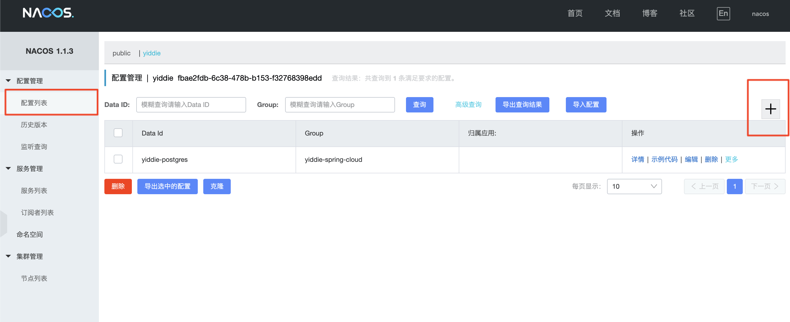
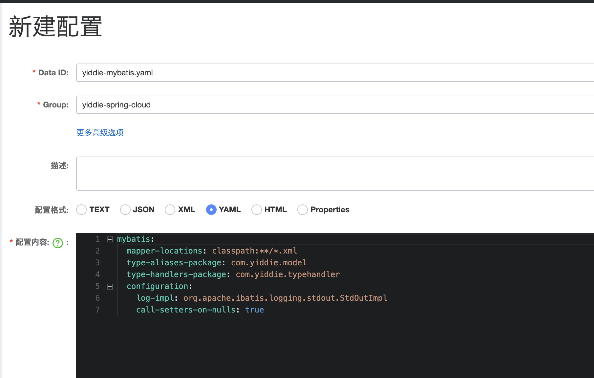

# Nacos

## 简介

Nacos 支持基于 DNS 和基于 RPC 的服务发现（可以作为springcloud的注册中心）、动态配置服务（可以做配置中心）、动态 DNS 服务。

官方介绍：

> Nacos 致力于帮助您发现、配置和管理微服务。Nacos 提供了一组简单易用的特性集，帮助您实现动态服务发现、服务配置管理、服务及流量管理。
> Nacos 帮助您更敏捷和容易地构建、交付和管理微服务平台。 Nacos 是构建以“服务”为中心的现代应用架构(例如微服务范式、云原生范式)的服务基础设施。

官方网址：[http://nacos.io](http://nacos.io/)

这里我们需要的是Nacos作为配置中心的功能。

## 安装

参考官方文档：[Nacos快速开始](https://nacos.io/zh-cn/docs/quick-start.html)

1. 下载源码或发行包。

   - 从github上下载源码后编译。

     >git clone https://github.com/alibaba/nacos.git
     >
     >cd nacos/
     >
     >mvn -Prelease-nacos clean install -U
     >
     >// change the $version to your actual path
     >
     >cd distribution/target/nacos-server\$version/nacos/bin

   - 下载[最新稳定版本](https://github.com/alibaba/nacos/releases)Nacos后解压。

     >unzip nacos-server-\$version.zip 或者 tar -xvf nacos-server-\$version.tar.gz
     >
     >cd nacos/bin

2. 启动

   > sh startup.sh -m standalone

   程序启动默认占用端口：8848，在bin目录下的startup.sh文件中添加如下一行代码即可更改端口号为9090：

   >JAVA_OPT="${JAVA_OPT} --server.port=9090"

## 使用说明

1. 进入图形化界面。

   >http://127.0.0.1:9090/nacos/index.html
   >
   >账号密码：nacos/nacos

2. 进入配置列表，新建配置。

   

   

3. 在项目的配置文件bootstrap.yml中添加如下配置。

   ```yml
   spring:
     cloud:
       nacos:
         config:
           server-addr: 127.0.0.1:9090
           file-extension: yaml
           namespace: fbae2fdb-6c38-478b-b153-f32768398edd
           group: yiddie-spring-cloud
           #        共享配置
           ext-config:
             - data-id: yiddie-postgres.yaml
               group: yiddie-spring-cloud
               namespace: fbae2fdb-6c38-478b-b153-f32768398edd
               refresh: true
   ```

   

